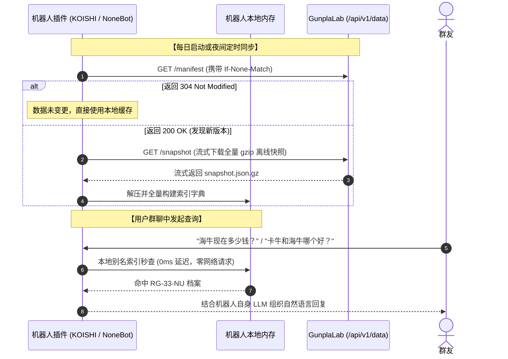

# 胶情局开放数据 API 开发者接入文档 (v1)

> **版本**：`v1`  
> **服务根路径 (Base URL)**：`http://localhost:3000/api/v1/data`  
> **设计哲学**：单一事实来源 · 零外部依赖 · 纯只读数据契约 · 高防灾低负载

---

## 目录

1. [服务概述与定位](#一-服务概述与定位)
2. [公共协议与规范](#二-公共协议与规范)
   - [请求头要求](#1-请求头要求)
   - [统一响应外壳 (Envelope)](#2-统一响应外壳-envelope)
   - [HTTP 304 协商缓存 (ETag)](#3-http-304-协商缓存-etag)
   - [通用错误响应与错误码](#4-通用错误响应与错误码)
3. [接口详细定义](#三-接口详细定义)
   - [1. 数据清册大纲: GET /manifest](#1-数据清册大纲-get-manifest)
   - [2. 全量紧凑离线快照: GET /snapshot](#2-全量紧凑离线快照-get-snapshot)
   - [3. 模型列表与多维检索: GET /items](#3-模型列表与多维检索-get-items)
   - [4. 单款模型全景档案: GET /items/{id}](#4-单款模型全景档案-get-itemsid)
   - [5. 模型行情价格观测: GET /items/{id}/prices](#5-模型行情价格观测-get-itemsidprices)
   - [6. 180天时序价格走势: GET /items/{id}/history](#6-180天时序价格走势-get-itemsidhistory)
   - [7. 官方发售排期日历: GET /release-events](#7-官方发售排期日历-get-release-events)
   - [8. 官方最新情报雷达: GET /intel-events](#8-官方最新情报雷达-get-intel-events)
   - [9. 开放服务健康探针: GET /health](#9-开放服务健康探针-get-health)
4. [群机器人最佳接入实践 (Best Practices)](#四-群机器人最佳接入实践)
   - [模式 A: 本地内存 0 延迟极速秒查 (强烈推荐)](#模式-a-本地内存-0-延迟极速秒查-强烈推荐)
   - [模式 B: 远程按需增量与精准查价](#模式-b-远程按需增量与精准查价)
5. [多语言接入示例](#五-多语言接入示例)

---

## 一、 服务概述与定位

GunplaLab 开放数据 API 专为各大社群机器人框架（如 OneBot、NoneBot、KOISHI、企微机器人等）与第三方模玩助手提供标准化只读数据支持。

- **GunplaLab 职责**：提供万代官方、78动漫等权威源清洗后的模型客观底账、官方日元发售价、四算五算黄金线、拼多多巡检现货价格、180 天时序行情与纯 CDN 外链；
- **第三方机器人职责**：负责理解用户自然语言对话、解析口语别名（如“卡牛”、“RG海牛”）、根据玩家预算给出购买建议与消息推送；
- **架构保障**：本服务严禁任何公网接口无门槛穿透调用外部爬虫，所有行情均来自于常态定时巡检沉淀。

---

## 二、 公共协议与规范

### 1. 认证鉴权与限流机制 (Auth & Rate Limiting)

GunplaLab 开放 API 采用**双轨制 (Tiered Access)**，兼顾轻量开放与生产级防刷：

- **公共匿名访问 (Public Tier)**：
  - 无需任何 Key，开箱即用；
  - 绑定调用方 IP，施加严格的基础限流（默认：**30 次/分钟**）；
- **授权机器人访问 (Bearer Token Tier)**：
  - 请求头携带：`Authorization: Bearer <api_key>`（亦兼容 URL Query `?api_key=<api_key>`）；
  - 配发专属机器人白名单，享有扩容配额（默认：**300 ~ 500 次/分钟**）；
  - 配置存储于 `backend/data/api_tokens.json`，支持管理员按需增删与动态调整配额；
  - 携带伪造或无效 Token 时拒绝访问并返回 `401 Unauthorized`。

#### 限流响应头 (Rate Limit Headers)
每个响应均附带标准的 RFC 限流状态头：
- `X-RateLimit-Limit`: 当前层级每分钟最大允许请求次数（如 `30` 或 `300`）；
- `X-RateLimit-Remaining`: 当前 60 秒滑动窗口内剩余可用请求次数；
- `X-RateLimit-Reset`: 距离当前滑动窗口重置的倒计时秒数。


### 2. 统一响应外壳 (Envelope)
所有业务响应均采用标准外壳封装，成功返回结构如下：

```json
{
  "ok": true,
  "data": { ... },
  "meta": {
    "api_version": "v1",
    "request_id": "req_1789238400_abc123",
    "timestamp": "2026-09-13T04:00:00+08:00",
    "data_as_of": "2026-09-13T03:51:00+08:00"
  }
}
```

| 字段 | 类型 | 说明 |
| :--- | :--- | :--- |
| `ok` | boolean | 请求是否成功，`true` 为成功，`false` 为失败 |
| `data` | object / array | 业务承载主体数据 |
| `meta.api_version` | string | 当前 API 版本号（固定 `v1`） |
| `meta.request_id` | string | 唯一追踪请求 ID |
| `meta.timestamp` | string | 服务端响应生成的 ISO 时间戳 |
| `meta.data_as_of` | string | 当前底层数据事实最后生效时间 |

### 3. HTTP 304 协商缓存 (ETag)
- 服务端会针对数据实体内容计算确定性的 `ETag` 指纹，并在响应头返回 `ETag: "<hash>"` 与 `Cache-Control: public, max-age=300`；
- 客户端再次请求时，带上请求头 `If-None-Match: "<hash>"`；
- 若底层数据无更新，服务端将直接返回 `304 Not Modified`（无包体），极大节省服务器与机器人带宽。

### 4. 通用错误响应与错误码
发生错误时（HTTP 4xx / 5xx），返回结构如下：

```json
{
  "ok": false,
  "error": {
    "code": "ITEM_NOT_FOUND",
    "message": "未找到模型: NON_EXISTENT_ID"
  },
  "meta": {
    "api_version": "v1",
    "request_id": "req_1789238400_abc123",
    "timestamp": "2026-09-13T04:00:00+08:00"
  }
}
```

| 错误码 (`code`) | 对应 HTTP 状态 | 含义与处置建议 |
| :--- | :--- | :--- |
| `UNAUTHORIZED` | `401 Unauthorized` | 携带了无效或伪造的 API Key，请核查 `Authorization` 请求头 |
| `RATE_LIMIT_EXCEEDED`| `429 Too Many Requests` | 请求频率超出配额，请降低频次或携带合法 Bearer Token 扩容 |
| `PARAM_MISSING` | `400 Bad Request` | 必填入参缺失 |
| `ITEM_NOT_FOUND` | `404 Not Found` | 查询的目标模型主键不存在 |
| `ENDPOINT_NOT_FOUND`| `404 Not Found` | 请求了未定义的 API 路径 |
| `SNAPSHOT_NOT_FOUND`| `404 Not Found` | 离线快照文件尚未生成完成 |
| `DB_QUERY_FAILED` | `500 Internal Error` | 底账查询异常 |

---

## 三、 接口详细定义

### 1. 数据清册大纲: `GET /manifest`
获取全库宏观收录规模、品类分布与快照校验信息。

- **URL**: `/api/v1/data/manifest`
- **方法**: `GET`
- **请求参数**: 无
- **响应示例** *(注：以下结构中的数值均为运行时动态计算生成的格式示意)*:
```json
{
  "ok": true,
  "data": {
    "version": "1.0.0",
    "generated_at": "2026-09-13T04:04:15+08:00",
    "total_items": 19070,
    "categories": {
      "gunpla": 10782,
      "rider": 5359,
      "ultraman": 2158,
      "guomo": 771
    },
    "snapshot": {
      "path": "/api/v1/data/snapshot",
      "size_bytes": 1223923,
      "size_formatted": "1.17 MB",
      "sha256": "98653d02e99b25ed44e5023b79568a30a8a787341677f1db217f579376f308d3",
      "updated_at": "2026-09-13T04:04:15+08:00"
    }
  },
  "meta": {
    "api_version": "v1",
    "request_id": "req_1789240000_a1b2c3",
    "timestamp": "2026-09-13T04:06:00+08:00",
    "data_as_of": "2026-09-13T04:04:15+08:00"
  }
}
```

---

### 2. 全量紧凑离线快照: `GET /snapshot`
流式直通下载经由 `gzip` 紧凑序列化的全库全量模型字典。

- **URL**: `/api/v1/data/snapshot`
- **方法**: `GET`
- **响应头**:
  - `Content-Type: application/json; charset=utf-8`
  - `Content-Encoding: gzip`
  - `Cache-Control: public, max-age=3600`
- **说明**: 客户端接收后直接作为 gzip 解压，解压后为一个包含 `meta` 与 `items`（包含全库全品类去重模型字典）的紧凑 JSON。

---

### 3. 模型列表与多维检索: `GET /items`
带分页的模型检索接口，支持按品类、系列、关键词或时间戳筛选。

- **URL**: `/api/v1/data/items`
- **方法**: `GET`
- **请求参数**:

| 参数名 | 类型 | 必填 | 默认值 | 说明 |
| :--- | :--- | :--- | :--- | :--- |
| `category` | string | 否 | 无 | 一级品类过滤：`gunpla` / `rider` / `ultraman` / `guomo` |
| `series` | string | 否 | 无 | 系列/形态过滤，如 `RG`、`MG`、`SHF`、`变身器` |
| `q` | string | 否 | 无 | 模糊搜索关键词（匹配中文名、日文名、ID、条码及别名） |
| `updated_after`| string | 否 | 无 | 增量过滤时间戳（ISO 格式），仅返回该时间之后更新的模型 |
| `page` | integer| 否 | `1` | 页码，从 1 开始 |
| `page_size` | integer| 否 | `50` | 每页条数（**系统强制锁定：1 ≤ page_size ≤ 100**） |

- **响应示例**:
```json
{
  "ok": true,
  "data": {
    "items": [
      {
        "item_id": "78dm_ct_100030",
        "category": "rider",
        "series": "变身器",
        "name_zh": "DX Eyecon Driver G",
        "name_ja": "DXアイコンドライバーG",
        "scale": "NON",
        "jan_code": "",
        "official_price": {
          "currency": "JPY",
          "amount": 6000,
          "conv4": 240.0,
          "conv5": 300.0
        },
        "sales_channel": "retail",
        "release_date": "2016-03",
        "reissue_date": "",
        "cover_url": "https://bbs-attachment-cdn.78dm.net/upload/2016/03/xxx.jpg",
        "rating": {
          "score": 8.0,
          "vote_count": 12
        },
        "updated_at": "2026-09-13 03:51:00"
      }
    ],
    "pagination": {
      "page": 1,
      "page_size": 50,
      "total_items": 5359,
      "total_pages": 108,
      "has_more": true
    }
  }
}
```

---

### 4. 单款模型全景档案: `GET /items/{id}`
查询单款模型的多维全景档案，包含官方身份、JAN 码、双轴分类、渠道、发售价格、评分与纯网络 CDN 封面。

- **URL**: `/api/v1/data/items/{item_id}`
- **方法**: `GET`
- **路径参数**: `item_id` (如 `RG-33-NU`, `78dm_ct_100030`)
- **响应示例**:
```json
{
  "ok": true,
  "data": {
    "item_id": "RG-33-NU",
    "identifiers": {
      "jan_code": "4573102612345",
      "aliases": ["RG海牛", "海牛高达", "Hi-Nu"]
    },
    "names": {
      "zh": "RG 33 海牛高达",
      "ja": "RG 1/144 Hi-νガンダム",
      "en": "RG 1/144 Hi-Nu Gundam"
    },
    "classification": {
      "category": "gunpla",
      "series": "RG",
      "scale": "1/144",
      "brand": "万代拼装",
      "work": "机动战士高达 逆袭的夏亚 贝托蒂嘉的子嗣",
      "universe": "UC",
      "sub_series": ""
    },
    "release": {
      "release_date": "2021-09",
      "reissue_date": "2026-10",
      "sales_channel": "retail",
      "is_limited": false
    },
    "official_price": {
      "currency": "JPY",
      "amount": 4950,
      "conv4": 198.0,
      "conv5": 247.5
    },
    "market_observation": {
      "current_price": 248.0,
      "currency": "CNY",
      "availability": "A",
      "source": "pdd",
      "source_url": "https://mobile.yangkeduo.com/goods.html?goods_id=...",
      "observed_at": "2026-09-12 18:30:00"
    },
    "links": {
      "cover_url": "https://bandai-hobby.net/images/products/...",
      "official_detail_url": "https://bandai-hobby.net/item/..."
    },
    "rating": {
      "score": 9.4,
      "vote_count": 412
    }
  }
}
```

---

### 5. 模型行情价格观测: `GET /items/{id}/prices`
获取指定模型当前的官方发售基准与在售现货电商巡检价格。

- **URL**: `/api/v1/data/items/{item_id}/prices`
- **方法**: `GET`
- **响应示例**:
```json
{
  "ok": true,
  "data": {
    "item_id": "RG-33-NU",
    "prices": [
      {
        "price_type": "official",
        "currency": "JPY",
        "amount": 4950,
        "conv4": 198.0,
        "conv5": 247.5,
        "source": "official_catalog",
        "observed_at": "2021-09"
      },
      {
        "price_type": "in_stock",
        "currency": "CNY",
        "amount": 248.0,
        "source": "pdd",
        "source_url": "https://mobile.yangkeduo.com/goods.html?goods_id=...",
        "availability": "A",
        "observed_at": "2026-09-12 18:30:00"
      }
    ],
    "last_checked_at": "2026-09-12 18:30:00"
  }
}
```

---

### 6. 180天时序价格走势: `GET /items/{id}/history`
获取半年时序折线价格历史记录，用于机器人生成“降价趋势”或价格波动图。

- **URL**: `/api/v1/data/items/{item_id}/history`
- **方法**: `GET`
- **请求参数**:
  - `days` (integer, 默认 180，最大 365)
- **响应示例**:
```json
{
  "ok": true,
  "data": {
    "item_id": "RG-33-NU",
    "days": 90,
    "record_count": 3,
    "history": [
      {
        "record_date": "2026-06-15",
        "price": 265.0,
        "conv4": 198.0,
        "conv5": 247.5,
        "source": "pdd",
        "status": "ok",
        "timestamp": "2026-06-15T03:15:00+08:00"
      },
      {
        "record_date": "2026-07-20",
        "price": 252.0,
        "conv4": 198.0,
        "conv5": 247.5,
        "source": "pdd",
        "status": "ok",
        "timestamp": "2026-07-20T03:15:00+08:00"
      },
      {
        "record_date": "2026-09-12",
        "price": 248.0,
        "conv4": 198.0,
        "conv5": 247.5,
        "source": "pdd",
        "status": "fresh",
        "timestamp": "2026-09-12T18:30:00+08:00"
      }
    ]
  }
}
```

---

### 7. 官方发售排期日历: `GET /release-events`
查询万代官网与各大官方渠道发布的发售/再版排期事件。

- **URL**: `/api/v1/data/release-events`
- **方法**: `GET`
- **请求参数**:
  - `month`: 筛选年月前缀，如 `2026-09` 或 `2026-10`；
  - `limit`: 返回条目数限制，默认 100，最大 200。
- **响应示例**:
```json
{
  "ok": true,
  "data": {
    "count": 2,
    "events": [
      {
        "eventId": "evt-sku-bandai-3391-2026-08",
        "title": "HG 1/144 斑豹高达",
        "eventType": "release",
        "dateLabel": "2026年8月",
        "sortKey": "2026-08",
        "officialPrice": {
          "amount": 2420,
          "currency": "JPY"
        },
        "sourceName": "BANDAI HOBBY（万代中国官网）",
        "sourceUrl": "https://bandaihobbysite.cn/index/index/detail/id/3391"
      }
    ]
  }
}
```

---

### 8. 官方最新情报雷达: `GET /intel-events`
获取万代拼装、Tamashii 魂商店最新公开的情报公告。

- **URL**: `/api/v1/data/intel-events`
- **方法**: `GET`
- **请求参数**:
  - `limit`: 返回条目数限制，默认 50，最大 100。
- **响应示例**:
```json
{
  "ok": true,
  "data": {
    "count": 1,
    "items": [
      {
        "id": "intel_20260912_001",
        "title": "MGSD 刹帝利",
        "category": "new",
        "subcategory": "MGSD",
        "releaseDate": "2026年09月发售",
        "price": "日本地区建议零售价：7,700日元(含税)",
        "source": "bandaihobbysite.cn",
        "url": "https://bandaihobbysite.cn/index/index/detail/id/3389"
      }
    ]
  }
}
```

---

### 9. 开放服务健康探针: `GET /health`
监控 API 服务及 SQLite 数据库只读状态。

- **URL**: `/api/v1/data/health`
- **方法**: `GET`
- **响应示例**:
```json
{
  "ok": true,
  "data": {
    "status": "healthy",
    "database": "connected",
    "api_version": "v1",
    "server_time": "2026-09-13T04:06:00+08:00"
  }
}
```

---

## 四、 群机器人最佳接入实践

为了保证群聊高并发下的极速响应，同时将网站服务器负载降至最低，强烈建议机器人接入者遵循以下实践：

### 模式 A: 本地内存 0 延迟极速秒查 (强烈推荐)



- **优势**：仅需每日下载一次全量紧凑离线快照，群内成千上万次查询全部在本地内存处理，完全不受网络波动或网站服务器限制。

### 模式 B: 远程按需增量与精准查价
- 仅当群友明确触发查价指令时，向 `/items/{id}/prices` 或 `/items/{id}/history` 发起单个模型精准查询。

---

## 五、 多语言接入示例

### 1. Python (标准库 `urllib` / `requests`)
```python
import gzip
import json
import urllib.request

BASE_URL = "http://localhost:3000/api/v1/data"

# 1. 检查清册
req = urllib.request.Request(f"{BASE_URL}/manifest")
with urllib.request.urlopen(req) as resp:
    manifest = json.loads(resp.read().decode("utf-8"))
    print(f"当前全库收录: {manifest['data']['total_items']} 款模型")

# 2. 获取全量离线快照 (gzip 解压)
req_snap = urllib.request.Request(f"{BASE_URL}/snapshot")
with urllib.request.urlopen(req_snap) as resp:
    raw_gz = resp.read()
    snapshot = json.loads(gzip.decompress(raw_gz).decode("utf-8"))
    print(f"本地成功载入模型数: {len(snapshot['items'])}")

# 3. 单模型详情查询
req_item = urllib.request.Request(f"{BASE_URL}/items/RG-33-NU")
with urllib.request.urlopen(req_item) as resp:
    item_detail = json.loads(resp.read().decode("utf-8"))
    p = item_detail["data"]["official_price"]
    print(f"官方四算黄金线: ¥{p['conv4']} (日元 {p['amount']})")
```

### 2. Node.js (JavaScript / TypeScript)
```javascript
const axios = require('axios');
const zlib = require('zlib');

const BASE_URL = 'http://localhost:3000/api/v1/data';

async function syncDataset() {
  // 1. 下载 snapshot (arraybuffer)
  const resp = await axios.get(`${BASE_URL}/snapshot`, {
    responseType: 'arraybuffer'
  });
  
  // 2. 解压 gzip
  const decompressed = zlib.gunzipSync(resp.data);
  const snapshot = JSON.parse(decompressed.toString('utf-8'));
  
  console.log(`成功同步 ${snapshot.items.length} 款模型数据至本地`);
}

syncDataset();
```

### 3. cURL 命令行
```bash
# 获取清册
curl -s http://localhost:3000/api/v1/data/manifest | jq .

# 模糊搜索“海牛”
curl -s "http://localhost:3000/api/v1/data/items?q=%E6%B5%B7%E7%89%9B&page_size=5" | jq .

# 下载全量快照
curl -s http://localhost:3000/api/v1/data/snapshot -o snapshot.json.gz
```
